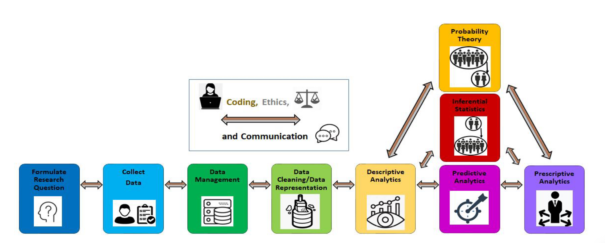

# Data Lifecycle

**Lifecycle model:** 
The data lifecycle we chose to relate our project to is the **MSSP Data Lifecycle**. We felt most comfortable using this lifecycle as a guiding framework since we work with it in other classes, such as Statistics 107 and 207. 

**Steps**

Formulate Research Questions: We began by exploring potential datasets and research questions. Since we were both interested in the NYC subway system and its reliability, we focused on finding high-quality data that could support meaningful analysis. 

>> Research Questions: 
>>
>> 1. What are the most common delays? Do they occur often?
>> 2. For each subway line and month, how many delay-causing incidents occurred, and how did it impact additional wait time for riders?
>> 3. Do peak (rush-hour) riders experience longer travel times than non-peak riders?

Collect Data: We ultimately selected two datasets from the DATA.NY.GOV website (reliable source).

>> Dataset 1: MTA Subway Delay-Causing Incidents: Beginning 2020
>>
>> Dataset 2: MTA Subway Customer Journey-Focused Metrics: 2020-2024

Data Management: To manage the data, we were able to store it in our GitHub repository. We discussed using Parquet files to store the data, but the datasets were small enough for us to manage it in its original state.

Data Cleaning/Data Representation: To used python to clean the data; We cleaned the data by converting each column to the correct data type, standardizing whitespace and capitalization, and fixing formatting issues to make entries consistent. We also checked the datasets for accuracy, completeness, consistency, and timeliness to ensure they were reliable for analysis.

Descriptive/Predictive Analytics: 

>>Q1 Research Answers: we discovered that "Police and Medical" activities were the most common reason for subway delays, causing 22,197 delays in 2024. 
>>
>>Q2 Research Answers: we discovered that there is a weak correlation between evidence the number of incidents and additional platform wait times. 
>>
>>Q3 Research Answers: we discovered that not all peak rush hour riders experience longer travel times than non-peak riders; however, 13 subway lines (out of 24) had peak rush hour riders spend more time traveling than non-peak riders. 

Coding, ethics, and communication: We utilized python to code our project. We did background information on both datasets -- for ethical reasons, the datasets do not reveal private information of individual riders. Finally, we built our git repository to communicate our project.

